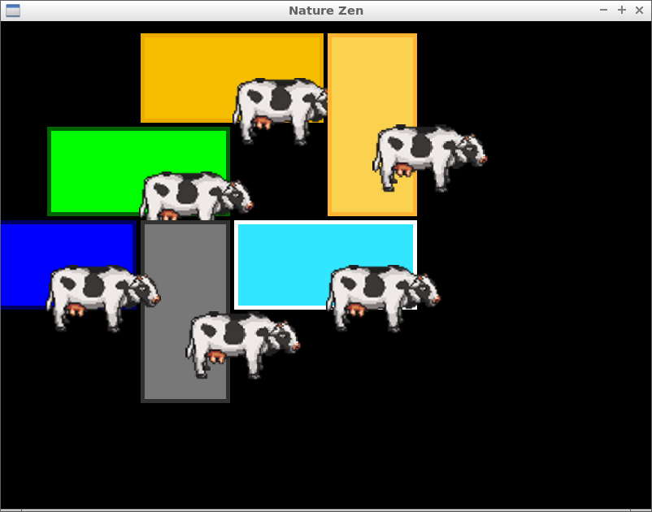
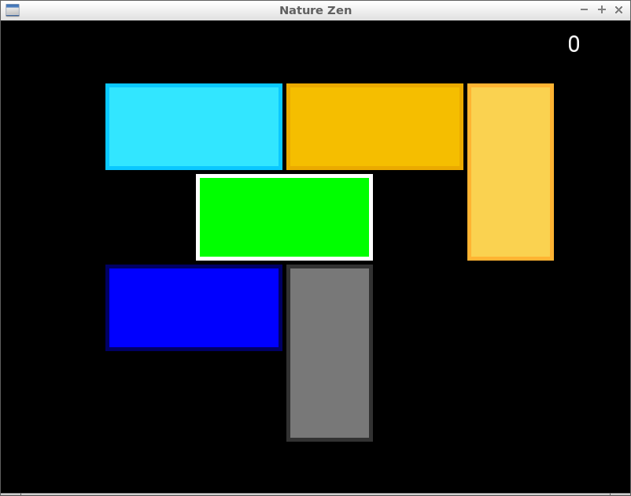
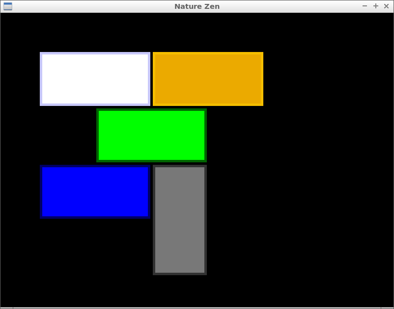
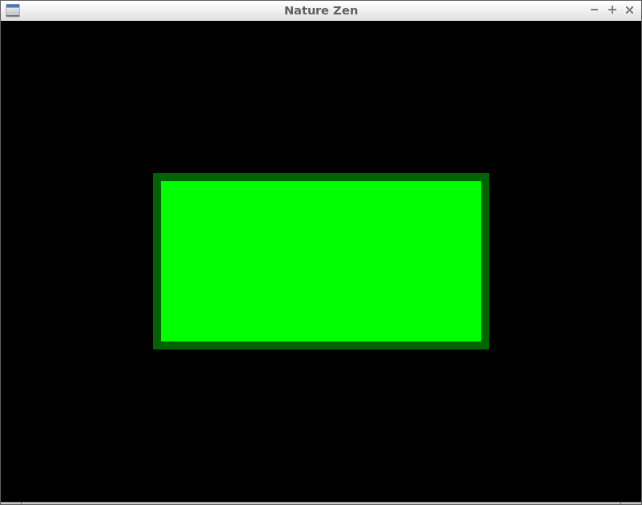

# Nature Zen

Branch||
---|---|---
`master`| | 
`develop`| | 
`annabel`| | 
`anne`| | 
`ellyjet`| | 
`isis`| | 
`joshua`| | 
`mart`| | 
`rafayel`| | 
`richel`| | 
`rijk`| | 
`same`| | 
`ellyjet`| | 
`jorn`| | 

## Goal

Collaboratively create a game, to be put on, for example, Steam.

  * [architecture](doc/architecture.md)
  * [code of conduct](code_of_conduct.md)
  * [coding standard](doc/coding_standard.md)
  * [game](doc/game.md)
  * [git](doc/git.md)
  * [install](doc/install.md)
  * [new members](doc/new_members.md)
  * [planning](doc/planning.md)
  * [social](doc/social.md)
  * [specifics](doc/specs.md)
  * [team](doc/team.md)
  * [todo](doc/todo.md)
  * [videos](doc/videos.md)

## Progress

Most recent at the top. See [videos](doc/videos.md) for the [videos](doc/videos.md).

