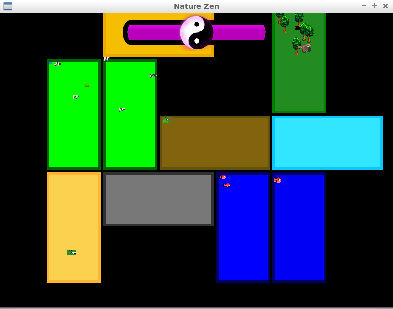
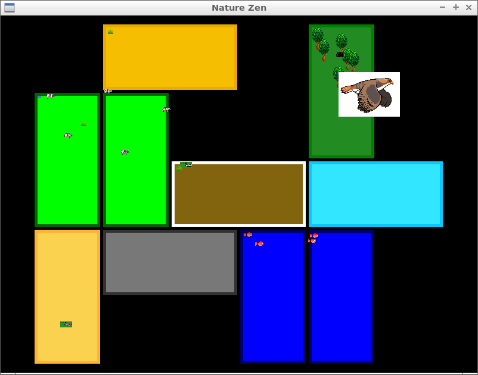

# Nature Zen

Main branches:

Branch|||
---|---|---|---
`master`| | |
`develop`| | |

Topic branches, ordered alphabetically:

Branch|||
---|---|---|---
`anne`| | |
`ellyjet`| | |
`enzo`| | |
`giorgio`| | |
`isis`| | |
`jan`| | |
`jana`| | |
`jolien`| | |
`joshua`| | |
`koen`| | |
`mart`| | |
`rafayel`| | |
`richel`| | |
`rijk`| | |
`rob`| | |
`same`| | |
`tom`| | |

## Goal

Collaboratively create a game, to be put on, for example, Steam.

  * [architecture](doc/architecture.md)
  * [code of conduct](code_of_conduct.md)
  * [coding standard](doc/coding_standard.md)
  * [FAQ](doc/faq.md)
  * [game](doc/game.md)
  * [git](doc/git.md)
  * [install](doc/install.md)
  * [new members](doc/new_members.md)
  * [new members procedure](doc/new_members_procedure.md)
  * [planning](doc/planning.md)
  * [social](doc/social.md)
  * [suggest and vote](doc/ideas.md)
  * [team](doc/team.md)
  * [technical specs](doc/specs.md)
  * [todo](doc/todo.md)
  * [videos](doc/videos.md)

## Progress

Most recent at the top. See [videos](doc/videos.md) for the [videos](doc/videos.md).

