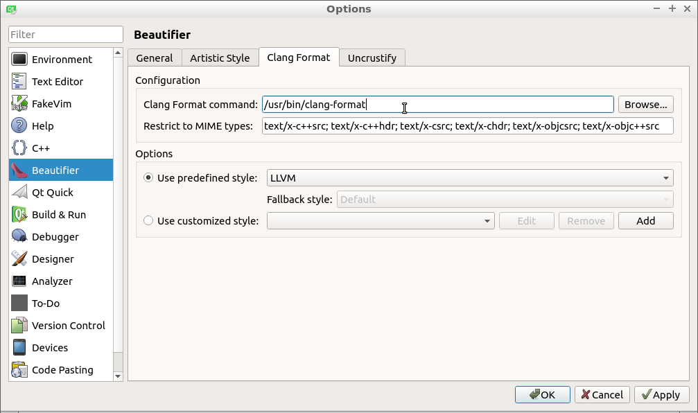
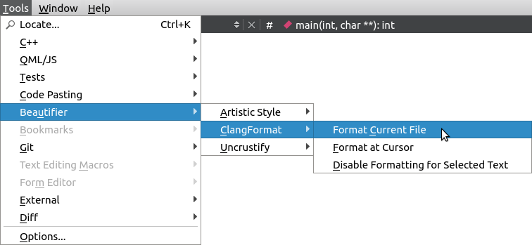

# Coding standard

This is the Nature Zen coding standard.

First and foremost, we follow [the C++ Core Guidelines](https://github.com/isocpp/CppCoreGuidelines/blob/master/CppCoreGuidelines.md).
Whenever @richelbilderbeek deviates from these guidelines, please create an Issue to let him know!

## Naming

We use snake_case for most names.

 * Class names: `game`, `sfml_game`, etc.
 * Function names: `do_this`
 * Header files are named after their classes, e.g. `game.h` is the header file for game
 * Member variables start with `m_`, e.g. `m_game`, `m_n_lives`, etc.
 * Static member variables start with `sm_`, e.g. `sm_id`. Remember: avoid `static`!

## Layout

We use beautifier for the coding layout.

Go to 'Help | Plugins':

Enable beautifier:

We use Clang Format with the predefined LLVM layout:

Under Linux, install Clang Format with `sudo apt install clang-format`.

Apply it to a file:

