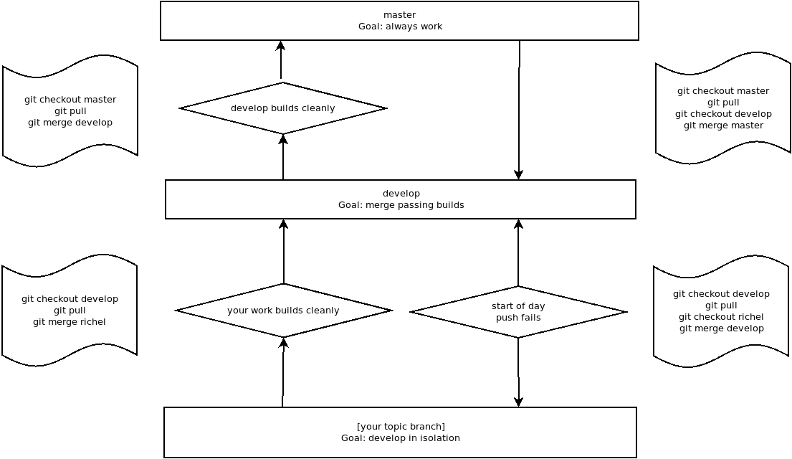

# `git`

All about `git`.

## Branching model

 * `master`: stable, should always pass
 * `develop`: development, merge of topic branches, should mostly pass
 * `[developer name]`: topic branch, for isolated development

## Clone this repository

```
git clone https://github.com/richelbilderbeek/djog_unos_2018
```

Then probably, you want to go into that folder:

```
cd djog_unos_2018
```

## Check the status

```
git status
```

This will show you which branch you are on, and which files you have changed.

## Checkout the `develop` branch

```
git checkout develop
```

Do this within the `djog_unos_2018` folder.

 * Note: there was a time when using `git checkout -t origin/develop` was
   recommended. This may have been unnecessarily complex

## Checkout your branch

If your branch is for example `richel`, do:

```
git checkout richel
```

Do this within the `djog_unos_2018` folder.

 * Note: there was a time when using `git checkout -t origin/richel` was
   recommended. This may have been unnecessarily complex

## Update a branch

```
git pull
```

Do this within the `djog_unos_2018` folder.

## Upload your work to GitHub

```
git add --all :/
git commit -m "Something brilliant"
git push
```

Do this within the `djog_unos_2018` folder.

Tips:

 * Use `fix #123` in the commit message if it fixed Issue 123
 * Use `[skip ci]` at the end of the commit message if Travis does not need to check it

## Merge the other's work with yours

First update `develop`:

```
git checkout develop
git pull
```

Then merge it with yours:

```
git checkout richel
git merge develop
git push
```

If you get merge conflicts and just want to use the `develop` version, use:

```
git checkout richel
git merge -X theirs develop
git push
```

## Merge your work with the other's

 * :warning: Only mediors and seniors are allowed to do this!

Go to `develop`:

```
git checkout develop
git pull
```

`git pull` should not do much! If it does, merge `develop` with your branch first.

If and only if `develop` was already up to date, merge it with yours:

```
git merge richel
git push
```

## Branching model as a picture


