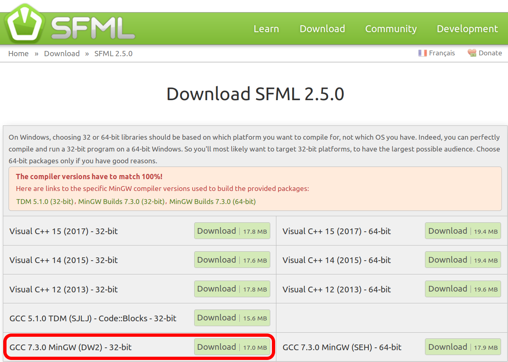

# Install

## Linux

Type this in a terminal:

```
sudo apt-get install -qq qtcreator libqt5webkit5-dev qtdeclarative5-dev libqt5svg5* libqt5svg5-dev libsfml-dev
```

Done!

## Windows


### Download and install Qt Creator


### Download and install SFML

 * Go to the SFML download page, [https://www.sfml-dev.org/download/sfml/2.5.0/](https://www.sfml-dev.org/download/sfml/2.5.0/)
 * Pick `GCC 7.3.0 MinGW (DW2) - 32-bit` [here](https://www.sfml-dev.org/files/SFML-2.5.0-windows-gcc-7.3.0-mingw-32-bit.zip)



 * Unpack the zip, it will create a folder called `SFML-2.5.0`
 * Rename that folder to `sfml`
 * Move that folder to within `C:/Qt`. Its new path will be `C:/Qt/sfml`

### Prepare Qt Creator

If you run the Qt Creator project now, you will get a `During Startup program exited with code 0xc0000135` error. This means it cannot find the path.

 * In Qt Creator, click 'Projects' (at the left vertical menu bar), go to 'Build', go to 'Build Environment', add to the `Path` variable: `C:\Qt\sfml\bin`

