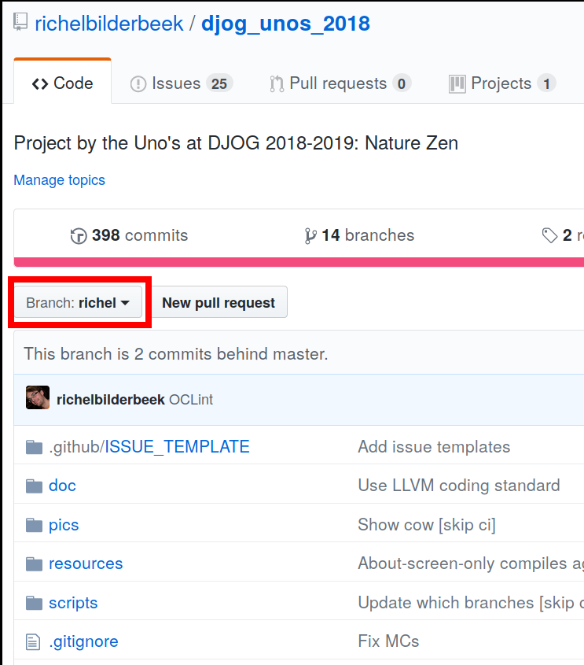
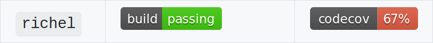
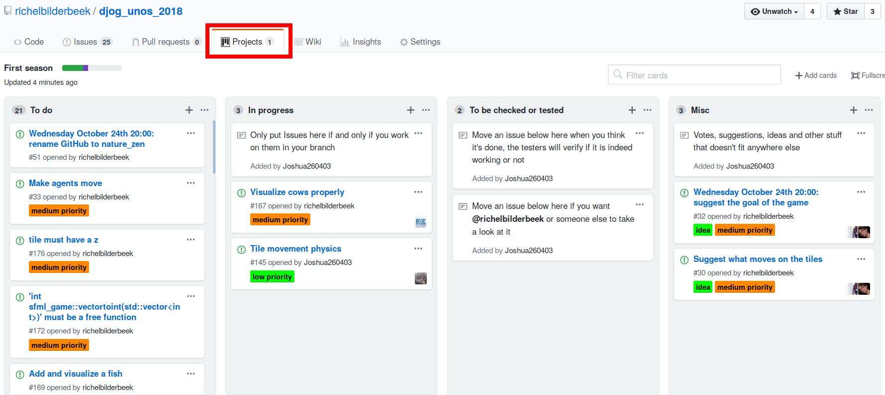

# New members

New team members are almost always welcome. 

To work together with the [team](team.md) smoothly, these things must be done:

## 1. Create a verified GitHub account

 * Go to [https://github.com](https://github.com) and create a new account
 * A verification email will be sent to your personal email address. Accept it
 * Let @richelbilderbeek know your GitHub username, either by
   [re-opening this Issue](https://github.com/richelbilderbeek/djog_unos_2018/issues/5)
   or send him an email

## 2. Install Qt Creator and SFML

See [install](install.md).

## 3. Create a branch for yourself

 * Log into GitHub
 * Go to the Nature Zen GitHub
 * Create a new branch for yourself:

## 4. Install git

 * Under Linux: `sudo apt install git`
 * Under Windows: download and install `git` and/or a git GUI:

    * [Git Bash](https://git-scm.com/download/win), for a command-line interface
    * Any [git GUI](https://git-scm.com/downloads/guis), for a graphical user interface

## 5. Clone Nature Zen to your local harddisc

See [git](git.md).

## 6. Check out your own branch

See [git](git.md).

## 7. Add your branch to `README.md`

On your local computer, edit the file `README.md`. This is the Nature Zen main page.
Add your name to the overview of branches.

Then do a `git` add, commit and push. See [git](git.md).

On the Nature Zen GitHub:

 * Switch to your branch

 * Check your build status

 * You can click on the 'Build' badge. Here you can theoretically wait for the build to finish

If the build passes, merge your work with develop. See [git](git.md).

## 8. Add your name to `doc/team.md`

On your local computer, edit the file `doc/team.md`. This is the Nature Zen team overview. Add your name to the list. Your initial function will be 'junior dev'.

Then do a `git` add, commit and push. See [git](git.md).

If the build passes, merge your work with develop. See [git](git.md).

## 9. Find something to do

 * Go to [the Nature Zen project page](https://github.com/richelbilderbeek/djog_unos_2018/projects)

 * Look for an Issue in the 'To do' column
 * Assign yourself that Issue
 * Move that Issue to the 'In progress' column
 * Fix it :+1:
 * Then do a `git` add, commit and push. See [git](git.md).
 * If the build passes, merge your work with develop. See [git](git.md).
