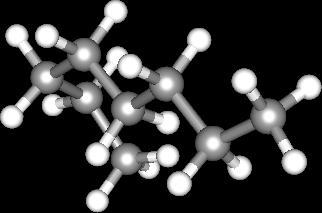

# Team

Name of our team: 'Octane'.

Ordered per day (both, TH, FR), then by first name. Roles are described below.

Day|Name|GitHub username|Role(s)
---|---|---|---
TH,FR|Joshua|`Joshua260403`|Dev (medior), `git`, wiki, CI
TH,FR|Richel|`richelbilderbeek`|Dev (senior), project manager, CI
TH|Annabel|`annabelliard`|Dev (junior)
TH|Isis|`?`|Dev (junior)
TH|Jorn|`JornPrengerFormeel`|Dev (junior), `git`
TH|Mart|`martje127`|Dev (junior), test
TH|Rijk|`Rijk-van-Putten`|Dev (junior)
FR|Anne|`annehinrichs22`|Dev (junior)
FR|Elles|`EllyJet`|Dev (junior)
FR|Jana|Jana17|Dev (junior)
FR|Jolien|`?`|Dev (junior)
FR|Koen|`ko0n`|Dev (junior)
FR|Rafayel|`RafayelGardishyan`|Dev (medior), `git`
FR|Rob|`robkruger`|Dev (junior)
FR|Same|`same-drenth`|Dev (junior), UX
FR|Tom|`?`|Dev (junior)
FR|Fauve| `Fauve`|Dev (junior)
Role|Description
---|---
CI|Maintain the Continuous Integration pipelines 
Dev|Change, write, document and test code
`git`|merges branches upstream iff downstream branches pass the build
Project manager|Make (potentially impopular) decisions
Test|Find and report bugs, allowed to close Issues in the `To be checked by testing column`
UX|Decide about the user experience
Wiki|Maintain wiki
